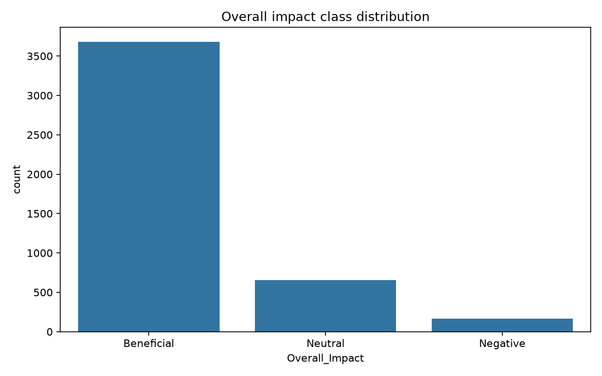
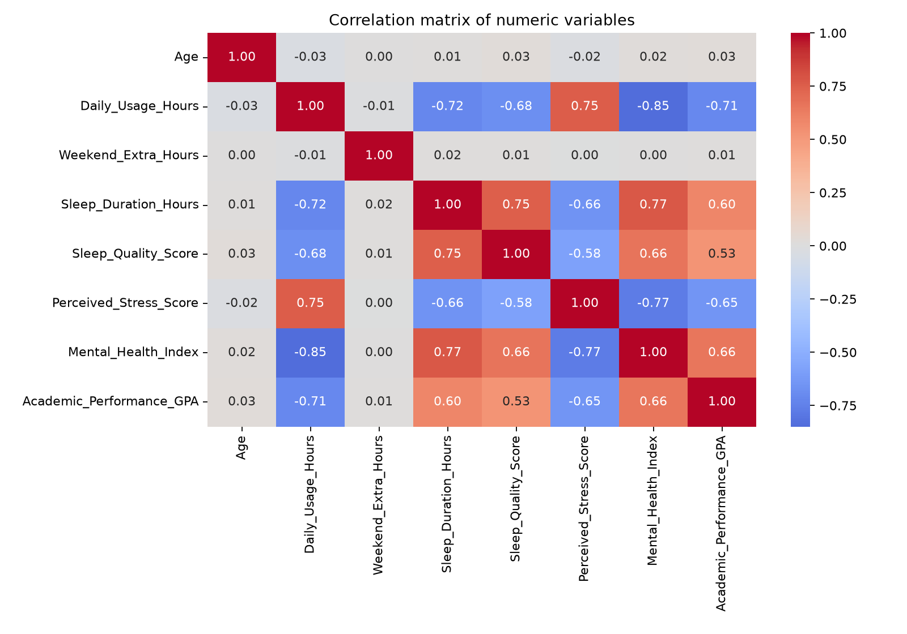
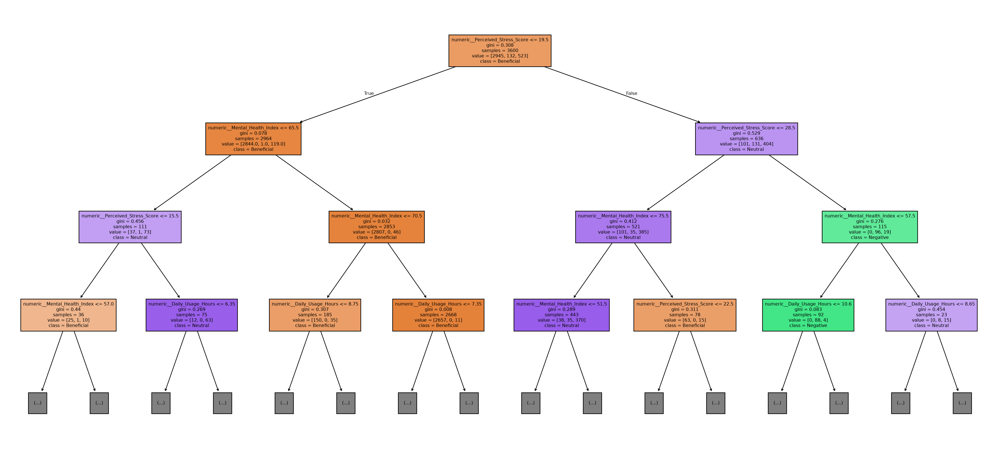
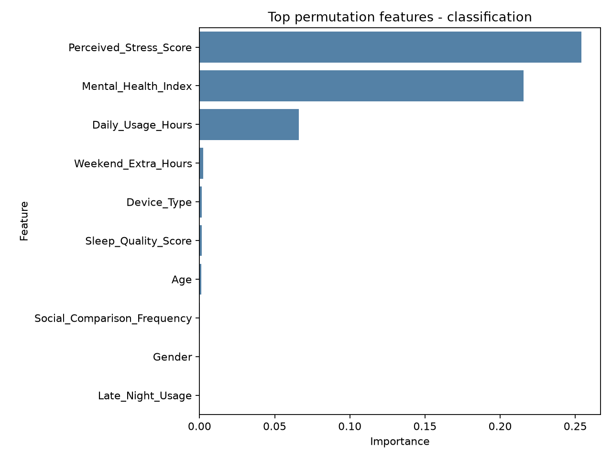
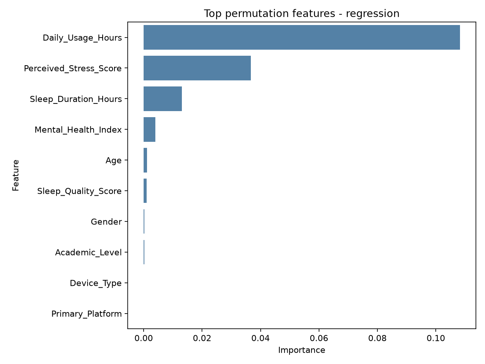

# Social Media Impact - gépi tanulási projekt

Ez a projekt a Kaggle **Impact of Social Media on Life** datasetjén vizsgálja,
hogy a közösségimédia-használat, az alvás, a stressz és a mentális egészség
mutatói alapján mennyire jelezhető előre:

- az `Academic_Performance_GPA` regressziós célváltozóként;
- az `Overall_Impact` (`Beneficial`, `Neutral`, `Negative`) klasszifikációs
  célváltozóként.

## Eredmények

| Feladat | Legjobb modell | Eredmény |
|---|---|---:|
| GPA-regresszió | Lineáris regresszió | RMSE: 0,269; R²: 0,567 |
| `Overall_Impact` klasszifikáció | Döntési fa | Accuracy: 95,44% |
| `Overall_Impact` klasszifikáció | Gradient boosting | Macro F1: 0,885 |

## Futtatás

```powershell
pip install -r requirements.txt
python social_media_ml_homework.py
```

Az ábrák és eredménytáblák a `results/` mappában találhatók. A részletes
magyar nyelvű magyarázatot a `social_media_ml_homework.md` tartalmazza.










